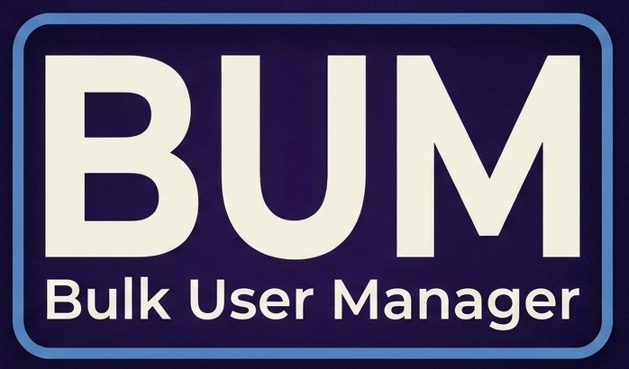

# Bulk User Manager

A Jellyfin plugin for administrators who need to manage user settings at scale. Mass-edit library order, playback preferences, subtitle settings, and permissions across multiple users at once, define defaults for newly created accounts, and back up or restore every user's configuration.

## Features

### Mass Edit User Settings
- Select any number of users with a filter box and select-all-visible button
- Reorder a user's libraries with up/down arrows
- Set audio language preference, play default audio track, remember audio selections, auto-play next episode
- Set subtitle mode, subtitle language preference, remember subtitle selections
- Only fields you explicitly set are written — untouched fields are preserved

### Mass Edit Permissions
- Toggle administrator status, disabled state, and hidden-from-login-screen
- Grant all-libraries access or restrict to specific libraries with checkboxes
- Fourteen feature toggles including downloads, media playback, transcoding, Live TV, remote access, and collection management
- Tri-state dropdowns so you can change one thing without touching everything else
- Confirmation dialogs guard against accidental mass-admin grants or mass account disabling

### Defaults for New Users
- Save a template of user settings and permissions
- The scheduled task applies the template to any user whose layout has never been customized
- Runs at startup and every 5 minutes, or manually from the Scheduled Tasks page
- Each user is initialized exactly once and never overwritten again

### Backup and Restore
- Download a JSON snapshot of every user's configuration and policy in one click
- Upload a backup to preview which users will be affected before confirming
- Two-step restore flow with a red confirm button and a per-user preview
- Skips users who no longer exist and reports per-user errors

## Requirements

- Jellyfin Server 12.0 or later
- .NET 10 runtime (included with Jellyfin 12)

## Installation

### From a repository

1. In Jellyfin, go to **Dashboard → Plugins → Repositories**
2. Click the **+** button
3. Paste the following URL: https://raw.githubusercontent.com/jnracreates/bulk-user-manager/main/manifest.json
4. Save, then go to **Catalog** and install **Bulk User Manager**
5. Restart Jellyfin

### Manual installation

1. Download the latest release zip from the [Releases page](https://github.com/jnracreates/bulk-user-manager/releases)
2. Extract `Jellyfin.Plugin.BulkUserManager.dll`
3. Create a folder in your Jellyfin plugins directory: <jellyfin-data>/plugins/Bulk User Manager/
4. Place the DLL in that folder
5. Restart Jellyfin

## Usage

Open **Dashboard → Plugins → Bulk User Manager** to access the plugin. Three tabs are available:

### Mass Edit tab
Select users, adjust the settings you want to change, and click **Apply to Selected Users**. The log panel shows the exact JSON payload sent to the server, useful for troubleshooting.

### Permissions tab
Same pattern, but for `UserPolicy` fields. Every dropdown defaults to `(no change)`, so a mass apply only touches what you explicitly set. Admin and disabled actions require a confirmation.

### Defaults tab
Configure the template applied to new users, then save. Use the three apply buttons to push the template to existing users. The **Backup** section downloads a full JSON snapshot, and the **Restore** section uploads one back.

## Recommended workflow

Before any bulk operation:

1. Go to the **Defaults** tab
2. Click **Download User Backup (JSON)**
3. Keep the file somewhere safe

If a bulk update goes wrong, use **Restore** to roll every user back to the state in the backup.

## Limitations

- **Home screen sections are not modifiable by plugins in Jellyfin 12.** The web client's home layout is driven by TanStack Query with IndexedDB caching, which plugins cannot reach. Use the [Home Screen Sections plugin](https://github.com/IAmParadox27/jellyfin-plugin-home-sections) if you need programmatic control over home layout.
- **Restore is all-or-nothing per backup file.** Selective per-user restore is not yet implemented.
- **The scheduled task applies defaults to users with an empty `OrderedViews` field on first sight**, then marks them as initialized. Users who have already customized their own layout are never touched.

## Building from source

```bash
git clone https://github.com/jnracreates/bulk-user-manager.git
cd bulk-user-manager
dotnet build -c Release
```
The resulting DLL will be at bin/Release/net10.0/Jellyfin.Plugin.BulkUserManager.dll

To package for release, install JPRM:
```bash
pip install --user jprm
jprm plugin build .
```

## License

MIT License. See [LICENSE](LICENSE) for details.

## Credits

Built for Jellyfin 12.0. Uses the public `IUserManager` API and does not patch or modify Jellyfin core.
